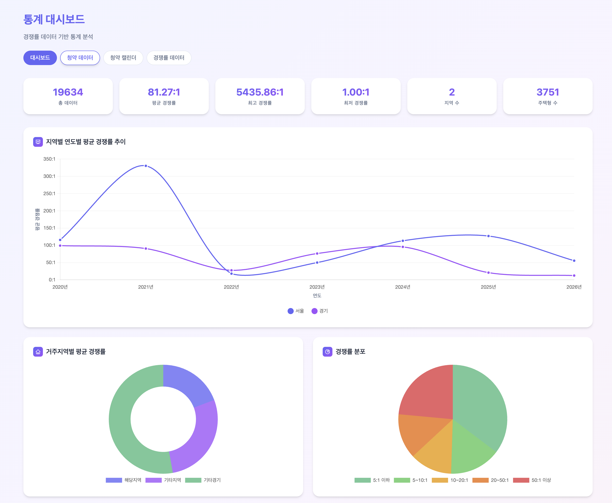
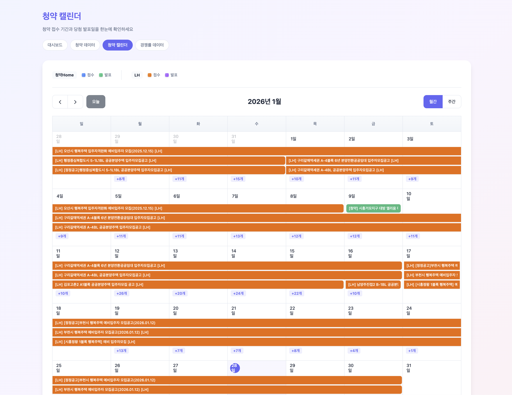
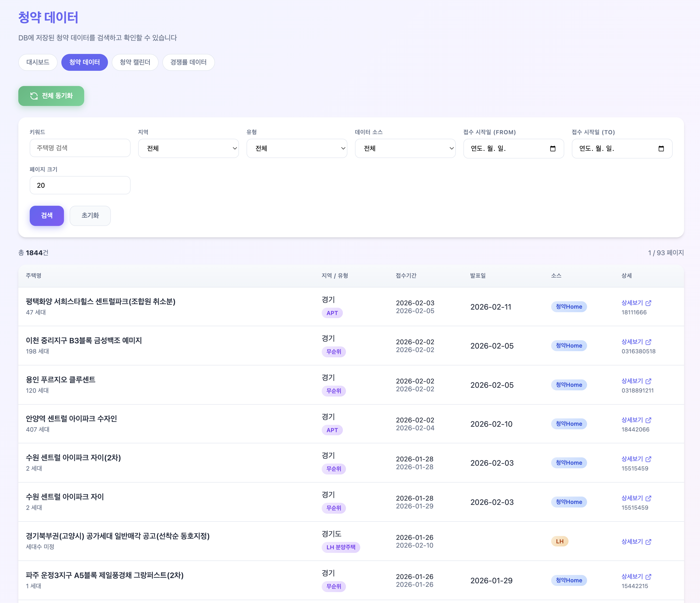
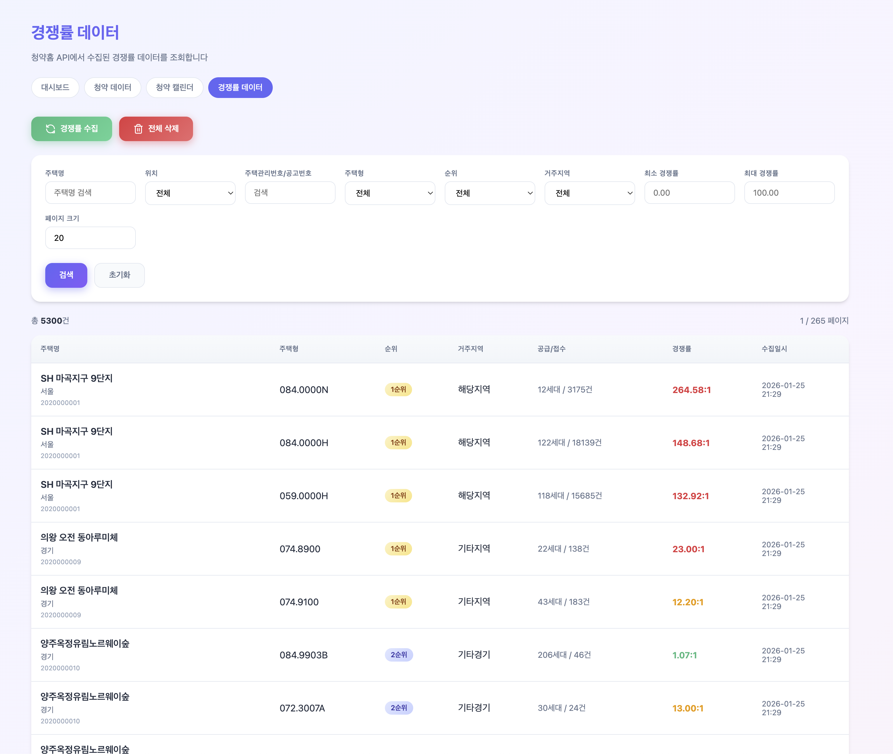
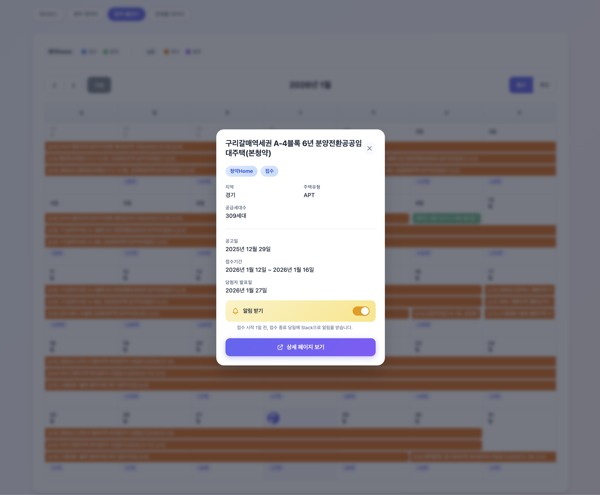

<div align="center">

# 🏠 Houseping

**청약 정보를 놓치지 마세요**

청약Home·LH 공공 API를 활용한 청약 알림 서비스

[](https://openjdk.org/)
[](https://spring.io/projects/spring-boot)
[](LICENSE)

</div>

---

## 개요

대한민국의 청약 정보는 LH, 청약Home 등 여러 출처에 흩어져 있어 한눈에 파악하기 어렵습니다.

Houseping은 **청약Home, LH 공공 API**에서 데이터를 자동 수집하고, 출처별로 다른 스키마를 표준 도메인 모델로 매핑하여 제공합니다.
- 매일 아침 9시 신규 청약 정보를 Slack/Telegram으로 발송
- 관심 청약 구독 시 접수 시작 전날과 마감 당일 리마인드 알림
- 월별 청약 캘린더 제공
- 과거 청약 경쟁률 통계 및 트렌드 분석

## 주요 기능

| 기능 | 설명 |
|------|------|
| **정기 수집** | 청약Home, LH API 및 웹 캘린더에서 청약·경쟁률 데이터 자동 수집 |
| **일일 알림** | 매일 09:00 신규 청약 정보를 Slack/Telegram으로 발송 |
| **구독 알림** | 관심 청약 구독 시 접수 시작 전날, 마감 당일 리마인드 |
| **청약 캘린더** | 월별 캘린더에서 접수·당첨 일정 한눈에 확인 |
| **경쟁률 분석** | 과거 청약 경쟁률 통계 및 트렌드 분석 |
| **관리자 대시보드** | 데이터 검색, 필터링, 수동 수집 실행 |

## 기술 스택

| 구분 | 기술 |
|------|------|
| **Backend** | Java 21, Spring Boot 3.5, Gradle |
| **Database** | H2 (내장), JPA, QueryDSL |
| **HTTP Client** | WebClient |
| **Notification** | Slack Webhook, Telegram Bot API |
| **Frontend** | Thymeleaf, FullCalendar.js |

## 데이터 범위

| 항목 | 범위 |
|------|------|
| **청약 유형** | 민영/공공 아파트, LH 임대주택, 신혼희망타운 |
| **데이터 소스** | 청약Home API, LH API, LH 웹 캘린더 |
| **지역 필터** | 시/도 단위 설정 가능 (기본: 서울, 경기) |
| **경쟁률** | 청약Home API 기준 과거 경쟁률 데이터 |

<details>
<summary><b>스크린샷</b></summary>

| 통계 대시보드 | 청약 캘린더 |
|:---:|:---:|
|  |  |

| 청약 데이터 | 경쟁률 데이터 |
|:---:|:---:|
|  |  |

| 알림 구독 |
|:---:|
|  |

</details>

## 패키지 구조

```
com.yunbok.houseping
├── domain                          # 핵심 비즈니스 로직
│   ├── model                       # 도메인 모델
│   ├── service                     # 도메인 서비스
│   └── port
│       ├── in                      # 인바운드 포트 (UseCase)
│       └── out                     # 아웃바운드 포트 (Repository, Provider)
│
├── adapter
│   ├── in
│   │   ├── web                     # REST Controller
│   │   └── scheduler               # 스케줄러
│   └── out
│       ├── api                     # 외부 API (청약Home, LH)
│       ├── web                     # 웹 파싱 (LH 캘린더)
│       ├── persistence             # DB 어댑터
│       └── notification            # 알림 (Slack, Telegram)
│
└── infrastructure                  # 설정, Entity, 유틸리티
```

## 시작하기

### 요구사항

- Java 21+
- Gradle 8.x
- 공공데이터포털 API 키 ([data.go.kr](https://data.go.kr))

> H2 내장 DB를 사용하므로 별도 데이터베이스 설치가 필요 없습니다.

### 1. 환경 변수 설정

```bash
cp .env.example .env
```

```properties
# 공공데이터포털 API 키
APPLYHOME_API_KEY=your_api_key
LH_API_KEY=your_api_key

# 알림 설정 (선택)
SLACK_WEBHOOK_URL=https://hooks.slack.com/services/xxx
TELEGRAM_BOT_TOKEN=your_bot_token
TELEGRAM_CHAT_IDS="chat_id1,chat_id2"
```
### 2. 실행

```bash
# 개발 환경
./gradlew bootRun

# 운영 환경 (백그라운드 실행)
./script/start.sh
```

> `start.sh`는 `.env` 파일을 자동 로딩하고 백그라운드로 실행합니다. 기본 프로파일은 `local`이며, 포트는 `application.yml`의 `server.port`에서 변경합니다. 종료는 `./script/stop.sh`를 사용합니다.

### 3. 접속

브라우저에서 대시보드에 접속하여 정상 실행을 확인합니다.

| 페이지 | URL |
|--------|-----|
| 대시보드 | http://localhost:10030/admin |
| 청약 캘린더 | http://localhost:10030/admin/subscriptions/calendar |
| 청약 데이터 | http://localhost:10030/admin/subscriptions |
| 경쟁률 데이터 | http://localhost:10030/admin/competition-rates |

## 설정

`application.yml`에서 데이터 소스 및 대상 지역을 설정합니다.

```yaml
feature:
  subscription:
    lh-web-enabled: true
    lh-api-enabled: true
    applyhome-api-enabled: true

subscription:
  target-areas:
    - 서울
    - 경기
```

> **LH Fallback 전략**: LH 공식 API에는 접수시작일 필드가 없어, 접수시작일을 제공하는 웹 캘린더를 우선 사용합니다. 웹 요청 실패 시 API → DB 순으로 Fallback됩니다. 우선순위는 `SubscriptionProviderChainConfig`에서 관리합니다.

## 확장하기

Hexagonal Architecture와 Chain of Responsibility 패턴을 적용하여 새로운 기능을 쉽게 추가할 수 있습니다. Provider를 체인으로 구성하여 첫 성공 응답을 채택하고, 실패 시 다음 Provider로 위임합니다.

| 확장 포인트 | 구현 방법 |
|-------------|-----------|
| **알림 채널 추가** | `NotificationSender` 인터페이스 구현 후 `adapter/out/notification/`에 추가 |
| **데이터 소스 추가** | `SubscriptionProvider` 인터페이스 구현 후 `SubscriptionProviderChain`에 등록 |
| **Fallback 순서 변경** | `SubscriptionProviderChainConfig`에서 Provider 등록 순서로 우선순위 조정 |
| **Feature Toggle** | `application.yml`의 `feature.subscription.*` 설정으로 on/off |