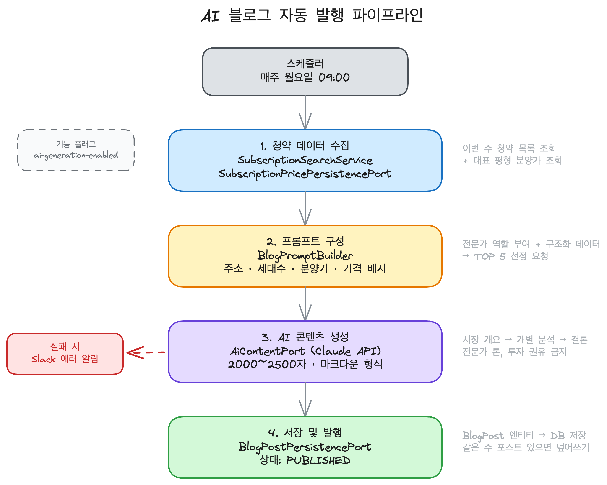

# AI 블로그 자동 발행 파이프라인

매주 월요일, 이번 주 청약 정보를 AI가 분석·요약하여 블로그 포스트를 자동 생성합니다.

## 전체 흐름

<div align="center">

</div>

## 주요 컴포넌트

### BlogPromptBuilder — 프롬프트 설계

Claude에게 전달하는 프롬프트를 구성합니다.

- **역할 부여**: 부동산 청약 분석 전문가
- **입력 데이터**: 청약별 주소, 세대수, 주택유형, 접수 상태, 접수일, 대표 평형 분양가, 가격 배지(시세대비↓/↑)
- **출력 요구사항**: TOP N 선정 → 시장 개요 → 개별 분석 → 결론
- **검증 규칙**: 날짜 정확성, 허위 데이터 생성 금지, 투자 권유 금지

### AiBlogContentService — AI 콘텐츠 생성

```
SubscriptionSearchService  →  이번 주 청약 카드 조회
SubscriptionPricePersistencePort  →  대표 평형 분양가 조회
BlogPromptBuilder  →  프롬프트 조립
AiContentPort (Claude API)  →  블로그 글 생성
```

### WeeklyBlogContentService — 스코어링 기반 콘텐츠 (수동 발행용)

AI 대신 규칙 기반으로 TOP N을 선정하는 대안 경로입니다.

| 요소 | 가중치 |
|------|--------|
| 가격 배지 CHEAP | +100 |
| 예상 시세 차익 | +1~50 (1000만원당 1점) |
| 접수중 상태 | +20 |
| 대단지 (500세대+) | +10 |
| 접수 임박 (7일 이내) | +15 |

선정된 청약별로 카드 이미지(800x500 PNG)와 내러티브 텍스트를 생성합니다.

### 두 가지 발행 경로

| 경로 | 트리거 | TOP N 선정 | 콘텐츠 생성 |
|------|--------|-----------|------------|
| **AI 자동 발행** | 스케줄러 (월요일 09:00) | Claude가 직접 선정 | Claude가 분석 글 작성 |
| **수동 발행** | 관리자 페이지 | 스코어링 알고리즘 | 카드 이미지 + 내러티브 + 네이버 HTML |

## 에러 처리

- 스케줄러 실패 시 Slack으로 에러 알림 발송
- `feature.blog.ai-generation-enabled` 플래그로 기능 on/off 제어
